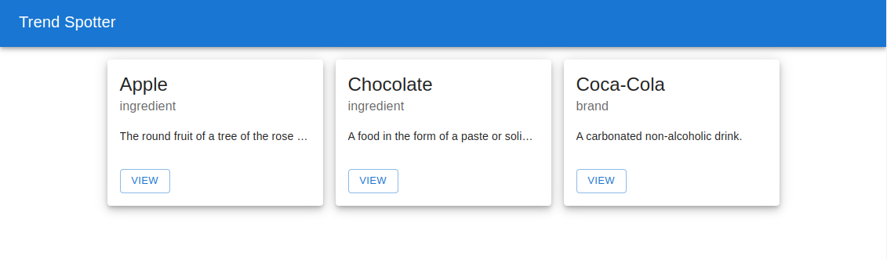

# Trend Spotter

Trend Spotter is a cutting-edge application designed to help users identify and stay up-to-date with the latest trends in various industries. Whether you're a business professional, a content creator, or simply interested in staying ahead of the curve, Trend Spotter provides you with real-time insights and analysis to keep you informed.

<br />

---
<br />


## 1. Getting Started

To run Trend Spotter on your local machine, please follow the instructions below:

### 1.1. Prerequisites

- Node.js (version 14.21.3 or above)
- npm (version 6.14.18 or above)

### 1.2. Installation

1. Clone the repository from GitHub:

```bash
git clone git@github.com:ddeklerk28/bsd-fe-test.git
```
2.  Install dependencies:

```bash
cd bsd-fe-test
npm istall

```

3. Run the application:
```bash
npm start
```
**NOTE:**  if the app does not open automatically, you can navigate to http://localhost:3002

<br />

---
<br />


## 2. Technical Tasks

You will required to to polish the app by performing some of the following tasks:
- **Bug fixes**
- **Styling & Layout**
- **Feature Implementation**

<br />

### Task 1 - Git
- Create and checkout a new branch with that follows the following convention `task/BSDTEST_<your-name-and-lastname-in-snake-case>`

<br />

### Task 2 - Styling & Layout (First Screen)
- Update the `client` styles to achieve the below layout. Each item being rendered should have a fixed width of 275px. The final solution should be responsive. 


<br />

### Task 3 - Bug Fixes (First Screen)
- 3.1 Find and fix the bug causing the trend name not to display
- 3.2 Figure out why the view button is not taking the user to the next screen and fix it.

<br />

---
<br />

## 3. Further Documentation

- [API Documentation](./server/API.md)