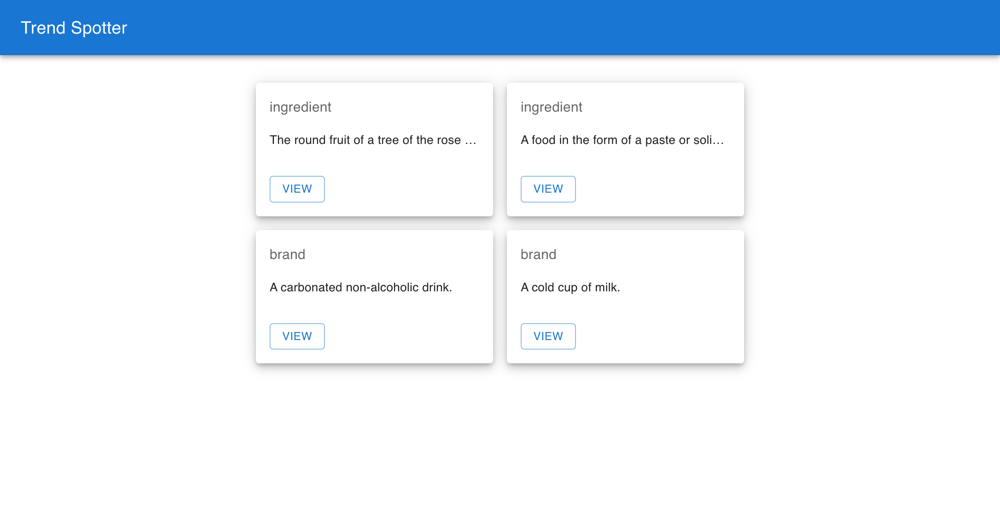

# Trend Spotter

Trend Spotter is a cutting-edge application designed to help users identify and stay up-to-date with the latest trends in various industries. Whether you're a business professional, a content creator, or simply interested in staying ahead of the curve, Trend Spotter provides you with real-time insights and analysis to keep you informed.

---


## 1. Getting Started

To run Trend Spotter on your local machine, please follow the instructions below:

### 1.1. Prerequisites

- Node.js (version 14.21.3 or above)
- npm (version 6.14.18 or above)

### 1.2. Installation

1. Clone the repository from GitHub:

```bash
git clone git@github.com:ddeklerk28/bsd-fe-test.git
```
2.  Install dependencies:

```bash
cd bsd-fe-test
npm istall

```

3. Run the application:
```bash
npm start
```
**NOTE:**  if the app does not open automatically, you can navigate to http://localhost:3002

---
## 2. Task List

There are a number of items that need to be addressed before the app can be considered polished and ready. 
Start with the `Task 1 - Git Workflow` and then pick up the tickets in any order you feel comfortable with.
Recommended time allocation:
- 1 SP: 2 - 5 minutes
- 2 SP: 5 - 7 minutes
- 3 SP: 7 - 12 minutes
>### Task 1: Git Workflow (1 SP)
>Create and checkout a new branch with that follows the following convention `task/BSDTEST_<your-name-and-lastname-in-snake-case>`

>### Task 2: Bug fix - Trends Screen (1 SP)
>Find and fix the bug causing the trend name not to display

>### Task 3: Styling & Layout - Trends Screen (2 SP)
>Update the `client` styles to achieve the below layout. Each item being rendered should have a fixed width of 275px. The final solution should be responsive. 
>
> 
>

>### Task 4: Bug Fix - Trends Screen (2 SP)
>Figure out why the view button is not taking the user to the Trend Details screen and fix it.

>### Task 5: Styling & Layout - Trend Details Screen (2 SP)
>Center the card along the vertical as well as the horizontal axis as indicated by the image below:
>
> 
>

>### Task 6: Integration - Trend Details Screen (3 SP)
>- Create an api service layer function called `fetchTrend`, that will fetch the data of single trend. See the API documentation for reference.
>- Use the new function to provide the second screen with data

---

## 3. Further Documentation
- [API Documentation](./server/API.md)
